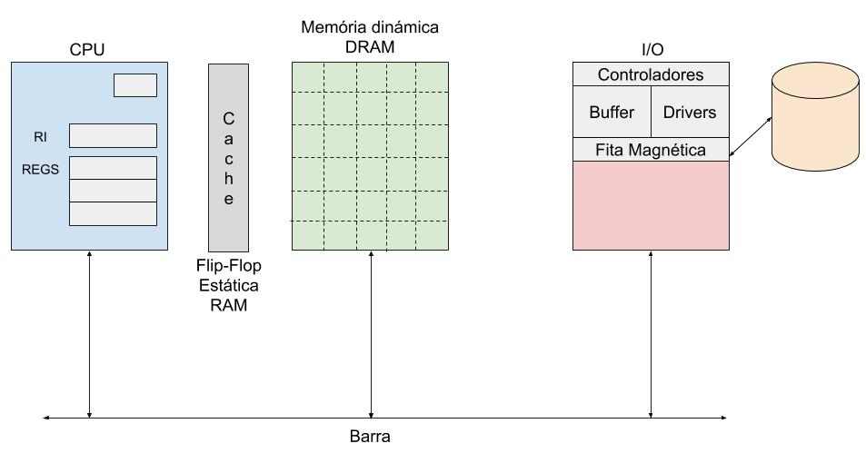
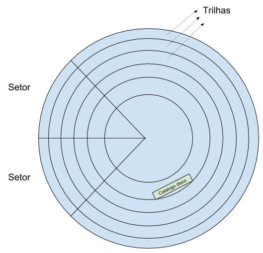
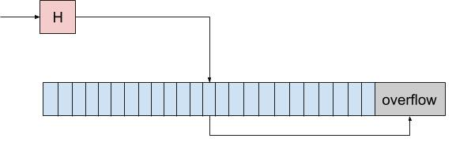

# Armazenamento em Disco
Banco de dados só faz sentido se tiver muitos dados, ou seja, precisamos de muito espaço e atualmente disco é a única maneira de armazenar muitos dados.  

Quando você compra um disco você tem que inicializar o disco, na incialização do disco ele cria essas marcações de trilha e setor, isso é gravado fisicamente no disco.  
Por isso o disco não tem exatamente o tamanho que você comprou, pois parte dele é usada para salvar essas informações.  

No disco tem uma trilha que diz onde está o catálogo do disco. Normalmente é no meio do disco que fica o catálogo.  
O meio do disco é onde a informação é percorrida mais rápida.  
No catálogo tem todas as informações importantes para o disco  
* Data de criação  
* Data de ultima atualização  
* Quem é o dono do arquivo  
* Organização do arquivo (como você acessa esse arquivo)  
* ...  

  

### Hierarquia de Memória

* HD
* Memória dinámica DRAM
* Memória estática RAM (Cache)
* Registradores (CPU)

**Espaço**:  
HD > Memória > Cache > CPU  

**Velocidade**:  
CPU > Cache > Memória > HD  

RAM/DRAM/CPU são memórias voláteis, se acabar energia, os dados são perdidos.  

#### Memória dinámica vs Cache
Cache utiliza memória estática (Flip-Flop). Uma vez que você altera um bit para 1, ele continua como 1 até que você altere de novo.  

Memória dinámica precisa que você atualize aquele bit de tempo em tempo se não é alterado. Você precisa ficar sustentando esse valor, se não é perdido.  

Por isso cache é utilizada pela CPU, pois seria horrível a CPU tentar acessar um valor enquanto está no ciclo de atualização da memória dinámica.  

#### HD vs SSD
Memória flash (SSD) tem aumentado a capacidade mas ainda não é tão confiável quando a memória disco. O SSD tem problema quando você faz muito acessos a uma mesma região, pois desgata muito rápido e depois fica difícil de conseguir acesso a informação.  

Por enquanto memória flash não substitui o HD.  

# Organização de Arquivos

* Heap (sequencial desordenado)  
  * Para inserir precisa percorrer até o final e adicionar
  * Para remover basta alterar ponteiros
* Sorted (sequencial ordenado)  
  * Para inserir precisa percorrer até a posição que ele deve ser inserido
  * Para remover basta alterar ponteiros
* Hash (acesso direto)  
  * Para inserir basta utilizar o hash e percorrer o overflow no pior caso
  * Para remover basta utilizar o hash e percorrer o overflow no pior caso
* Indexado (sequencial indexado)  
  * .
  * .

Sequencial = Ponteiro  
Acesso Direto = Calcular posição  

### Hash colisão
A implementação que já ouvimos no curso envolve botar no próximo espaço quando ocorre colisão.  

Porém uma implementação clássica para resolver esse problema é criar uma área de overflow.  
Se o que você estiver procurando não estiver na posição que o hash aponta, então grande chance de estar na área de overflow.  

  

### B Tree
> Todo nó deve ter pelo menos metade da capacidade.  

Essa regra ajuda a impedir um crescimento linear ou desnecessário.  

Vamos supor que sempre inserimos em um novo nó  
Começamos inserindo 5  

| | | | |
| --- | --- | --- | --- |
| 5 | | | |

Depois 6    

| | | | |
| --- | --- | --- | --- |
| 5 | | | |
| | 6 | | |

Depois 7  

| | | | |
| --- | --- | --- | --- |
| 5 | | | |
| | 6 | | |
| | | 7 | |

Aqui você já nota como poderia criar um crescimento linear se formos adicionando sem pensar.  
Se seguirmos a regra, só poderemos criar um novo nó quando o nó pai estiver cheio  
Começamos inserindo 5  

| | | |
| --- | --- | --- |
| 5 | | | |

Depois 6    

| | | |
| --- | --- | --- |
| 5 | 6 | | |

Depois 7  

| | | |
| --- | --- | --- |
| 5 | 6 | 7 | |

Depois 8  

| | | | |
| --- | --- | --- | --- |
| 5 | 6 | 7 | 8 |

Depois 9   

| | | | | |
| --- | --- | --- | --- | --- |
| 5 | 6 | 7 | | |
| | | | 8 | 9 |

Depois 1   

| | | | | | |
| --- | --- | --- | --- | --- | --- |
| 1 | 5 | 6 | 7 | | |
| | | | | 8 | 9 |

Depois 2   

| | | | | | | |
| --- | --- | --- | --- | --- | --- | --- |
| | | 5 | 6 | 7 | | |
| 1 | 2 | | | | 8 | 9 |

Um problema que você deve notar é, se a árvore acabou de ser criada... Não temos como seguir essa regra para a raiz. Assim que inserimos a primeira vez, a raiz já começa quebrando a regra.  
Por isso precisamos da seguinte regra  

> A raiz pode ter no mínimo 2 elementos  

Essa regra nos ajuda a apenas criar a árvore se for necessário (se você tem dois elementos) e permite a raiz a começar a existir no início.  

Agora precisamos cuidar para que a performace da árvore não seja alterada conforme a gente adicione, por exemplo  
Começamos inserindo 5  

| | | |
| --- | --- | --- |
| 5 | | | |

Depois 6    

| | | |
| --- | --- | --- |
| 5 | 6 | | |

Depois 7  

| | | |
| --- | --- | --- |
| 5 | 6 | 7 | |

Depois 8  

| | | | |
| --- | --- | --- | --- |
| 5 | 6 | 7 | 8 |

Depois 9   

| | | | | |
| --- | --- | --- | --- | --- |
| 5 | 6 | 7 | | |
| | | | 8 | 9 |

Depois 10   

| | | | | | |
| --- | --- | --- | --- | --- | --- |
| 5 | 6 | 7 | | | |
| | | | 8 | 9 | 10 |

Depois 11   

| | | | | | | |
| --- | --- | --- | --- | --- | --- | --- |
| 5 | 6 | 7 | | | | |
| | | | 8 | 9 | 10 | 11 |

Depois 12   

| | | | | | | | |
| --- | --- | --- | --- | --- | --- | --- | --- |
| 5 | 6 | 7 | | | | | |
| | | | 8 | 9 | | | |
| | | | | | 10 | 11 | 12 |

Se continuarmos inserindo assim, vamos ter uma árvore apenas com um galho, crescendo em uma direção.  

> Todas as folhas devem estar no mesmo level  

Isso nos obriga a manter as folhas no mesmo level, com isso o acesso a uma folha ou outra não tem uma diferença anormal.  

> Bottom-up  

Vamos supor que queremos inserir 10, 20, 40, 50  
Os nós tem espaço para 3  

| | | |
| --- | --- | --- |
| 10 | | | |

Inserindo 20

| | | |
| --- | --- | --- |
| 10 | 20 | | |

Inserindo 40

| | | |
| --- | --- | --- |
| 10 | 20 | 40 | |

Inserindo 50

| | | | |
| --- | --- | --- |
| | | 40 | |
| 10 | 20 | | 50 |

Note que o nó foi criado em cima e ele vai apontar para o novo nó e o nó antigo  
Vamos continuar inserindo 60, 70, 80  

| | | | | |
| --- | --- | --- | --- |
| | | 40 | | |
| 10 | 20 | | 50 | 60 |

| | | | | | |
| --- | --- | --- | --- | --- |
| | | 40 | | | |
| 10 | 20 | | 50 | 60 | 70 |

| | | | | | |
| --- | --- | --- | --- | --- |
| | | 40 | | | |
| 10 | 20 | | 50 | 60 | 70 |

| | | | | | | |
| --- | --- | --- | --- | --- | --- |
| | | 40 | | | 70 | |
| 10 | 20 | | 50 | 60 | | 80 |

Primeiro nó tem 40 e 70
Segunda linha tem 3 nós  
10 e 20  
50 e 60  
80    

Mais sobre o assunto: https://www.youtube.com/watch?v=aZjYr87r1b8  
