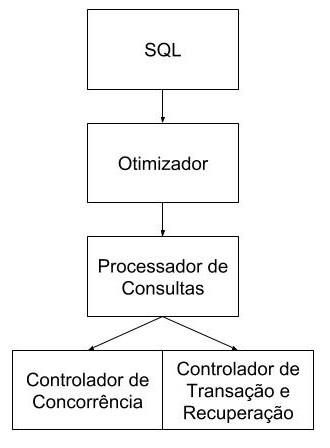
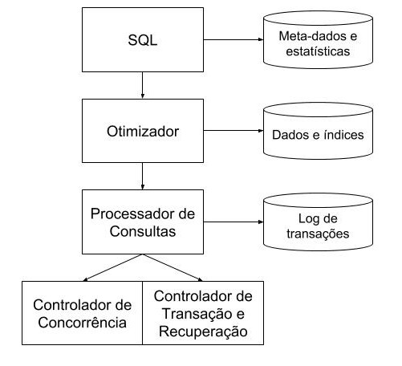
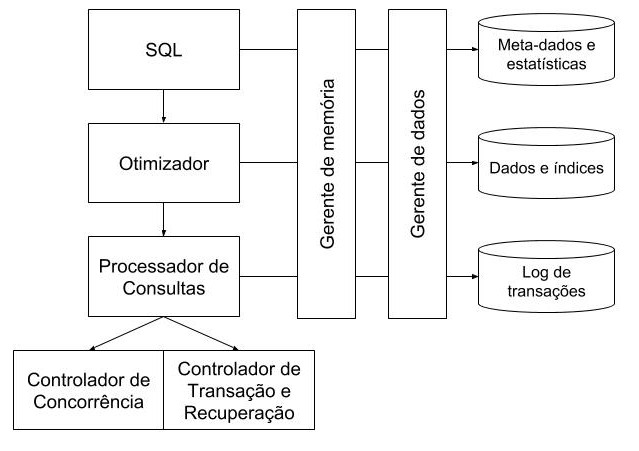

# Arquitetura SGBD

Uma consulta SQL passa por vários módulos do sistema antes de ser interpretada pelos bancos de dados.  

* **SQL**: A consulta SQL enviado pelo usuário.  
* **Otimizador**: Otimiza a consulta para que acesse os dados do banco de dados com mais desempenho.  
* **Processador de Consultas**: É o responsável por enviar a consulta e obter a o resultado.  
* **Controlador de Concorrência**: Se duas pessoas querem usar o mesmo dado, ele vai proveder as propriedades ACID de banco de dados.   
* **Controlador de Transação e Recuperação**: Controla para transições bloquiarem os dados que estão utilizando e para que possam ser desfeitas ou confirmadas.  

  

### Otimizador
Verifica se a formação da consulta está correta.  
Verifica se a tabela e coluna existem na meta-base.  
Modifica a consulta para melhorar desempenho (melhor tempo e consumo de recurso).  

SGBDs conseguem otimizar pois eles tem acesso a meta-dados, ou seja, informação sobre as tabelas. Então o SGBD sabe:  
* Quanto é o tamanho de cada tabela  
* Quantos registros tem cada tabela  
* Se a tabela tem indice ou não  
* Qual a estrutura do arquivo da tabela
* Se é de acesso direto ou indexada  
* ...  

O resultado é **plano de acesso** que mostra como a consulta deve ser processada para o melhor desempenho.  

**Nota**: Compiladores C costumam otimizar e alterar seu código antes de transformar em assembly. Se seu código tem `int x = 1 + 2`, muito provável que seu compilador irá alterar o código para `int x = 3` pois é menos custoso do que fazer a operação de soma. Compiladores otimizam bem mais que esse exemplo simples.  

### Processador de Consultas  
Utilizando o plano de acesso obtido anteriormente o processador obtem a tabela com a resposta à consulta.

### Controlador de Concorrência
Controla para que os usuários consigam acessar aos dados em concorrência porém com a aparência de que estão executando isoladamente, ou seja, que o usuário ainda possui todo o banco disponível para acessar sem problema.  

### Controlador de Transação e Recuperação
Durante uma transação os dados utilizados são bloqueados para a segurança das operações. Ao final da transação você deve confirmar as mudanças ou nega-las.  

Se confirma com o comando `COMMIT`  
Se desfaz com o comando `ROLLBACK`  

#### Transação
Bloquea dados para uso próprio e outros usuários ficam a espera para aquele dado ser liberado. É necessário um cuidado com a quantidade de dados que você bloquea e o quanto popular eles são, pois você não quer deixar muitas pessoas esperando o acesso a esses dados.  

É possível bloquear acesso a quantos dados você quiser:  
* Bloquear acesso ao banco de dados inteiro  
* Bloquear acesso a uma ou mais tabelas  
* Bloquear acesso a uma ou mais tuplas    

#### Recuperação
Caso algum error tenha ocorrido ou o resultado não seja esperado, você pode desfazer todas as mudanças feitas durante a transação.  

# Base de dados
Existem bases de dados importantes para cada um dos módulos utilizar durante suas etapas.  

* **Otimizador**
  * Meta-dados e Estatísticas
* **Processador de Consultas**
  * Dados e índices
* **Controlador de concorrência + COntrolador de Transação e Recuperação**
  * Log de Transações  

## Gerente de Armazenamento
É composto pelo gerente de memória e gerente de dados.  
Gerente de armazenamento cuida de controlar a memória do sistema e garantir um acesso eficiente aos dados, nenhum dos modulos anteriores fala direto com os dados.  

  
