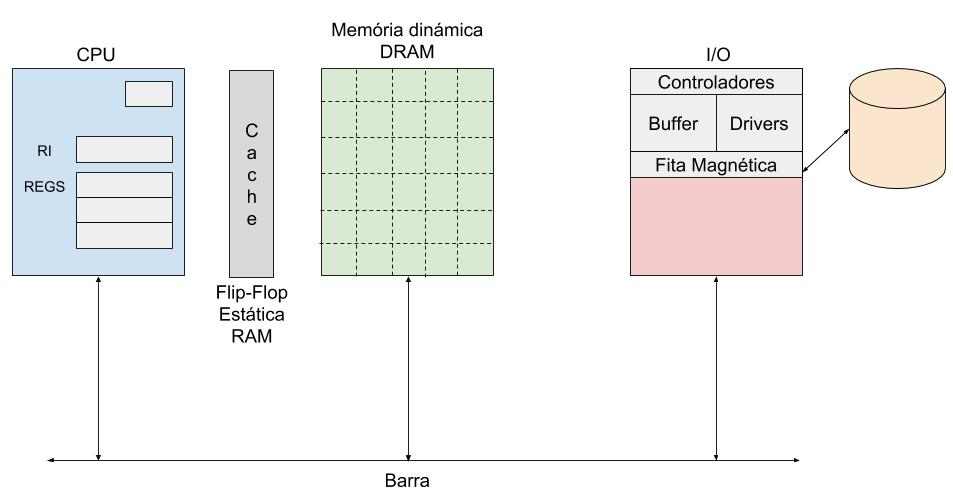
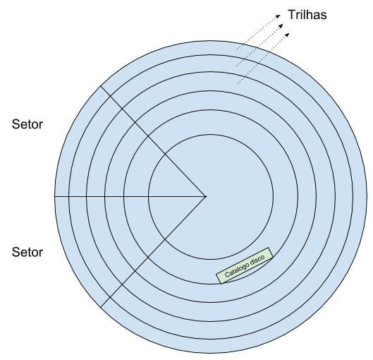
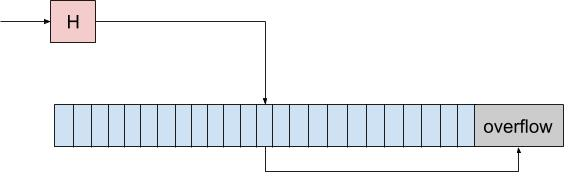

# Armazenamento em Disco
Banco de dados só faz sentido se tiver muitos dados, ou seja, precisamos de muito espaço e atualmente disco é a única maneira de armazenar muitos dados.  

Memória flash (SSD) tem aumentado a capacidade mas ainda não é tão confiável quando a memória disco. O SSD tem problema quando você faz muito acessos a uma mesma região, pois desgata muito rápido e depois fica difícil de conseguir acesso a informação.  

Por enquanto memória flash não substitui o HD.  

Quando você compra um disco você tem que inicializar o disco, na incialização do disco ele cria essas marcações de trilha e setor, isso é gravado fisicamente no disco.  
Por isso o disco não tem exatamente o tamanho que você comprou, pois parte dele é usada para salvar essas informações.  

No disco tem uma trilha que diz onde está o catálogo do disco. Normalmente é no meio do disco que fica o catálogo.  
O meio do disco é onde a informação é percorrida mais rápida.  
No catálogo tem todas as informações importantes para o disco  
* Data de criação  
* Data de ultima atualização  
* Quem é o dono do arquivo  
* Organização do arquivo (como você acessa esse arquivo)  
* ...  

# Organização de Arquivos

* Heap (sequencial desordenado)  
  * Para inserir precisar percorrer até o final e adicionar
  * Remover basta alterar ponteiros
* Sorted (sequencial ordenado)  
* Hash (acesso direto)  
* Indexado (sequencial indexado)  

Sequencial = Ponteiro  
Acesso Direto = Calcular posição  

### Hash colisão
A implementação que já ouvimos no curso envolve botar no próximo espaço quando ocorre colisão.  

Porém uma implementação clássica para resolver esse problema é criar uma área de overflow.  
Se o que você estiver procurando não estiver na posição que o hash aponta, então grande chance de estar na área de overflow.  

  

39:59
